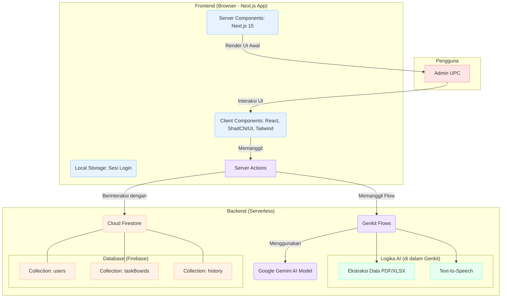

# Diagram Arsitektur NAVIGA

Berikut adalah diagram yang memvisualisasikan arsitektur frontend dan backend aplikasi NAVIGA. Anda dapat menyalin kode di bawah ini dan menempelkannya ke editor yang mendukung Mermaid (seperti [Mermaid Live Editor](https://mermaid.live) atau plugin di VS Code) untuk melihat diagramnya.

### Penjelasan Singkat Diagram

1.  **Pengguna (Admin UPC)**: Berinteraksi dengan antarmuka aplikasi.
2.  **Frontend**:
    *   **Client Components**: Menangani semua interaksi pengguna (klik tombol, input form) dan memanggil *Server Actions*.
    *   **Server Components**: Merender tampilan awal halaman untuk performa cepat.
    *   **Local Storage**: Digunakan secara minimalis, hanya untuk menyimpan status sesi login.
3.  **Backend (Serverless)**:
    *   **Server Actions**: Bertindak sebagai jembatan aman antara frontend dan logika backend.
    *   **Genkit Flows**: Mengorkestrasi tugas-tugas AI, seperti memanggil model Gemini untuk ekstraksi data atau TTS.
    *   **Google Gemini AI**: Model AI yang melakukan pekerjaan berat seperti analisis dokumen.
    *   **Cloud Firestore**: Database NoSQL tempat semua data persisten aplikasi (profil, tugas, riwayat) disimpan.

Diagram ini menunjukkan bagaimana data mengalir dari interaksi pengguna, diproses oleh Next.js, diperkaya oleh AI melalui Genkit, dan akhirnya disimpan atau diambil dari Cloud Firestore.
